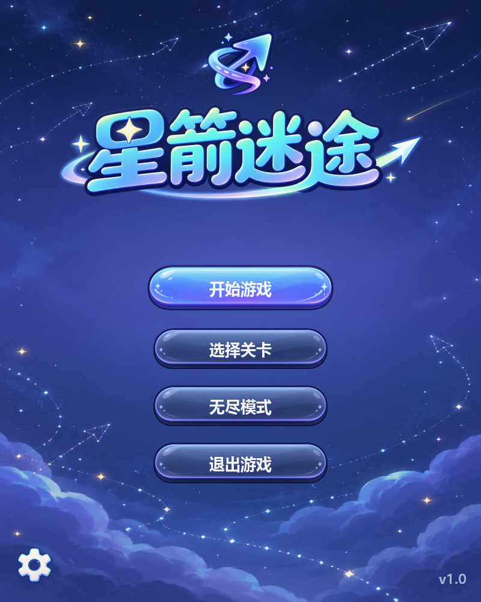
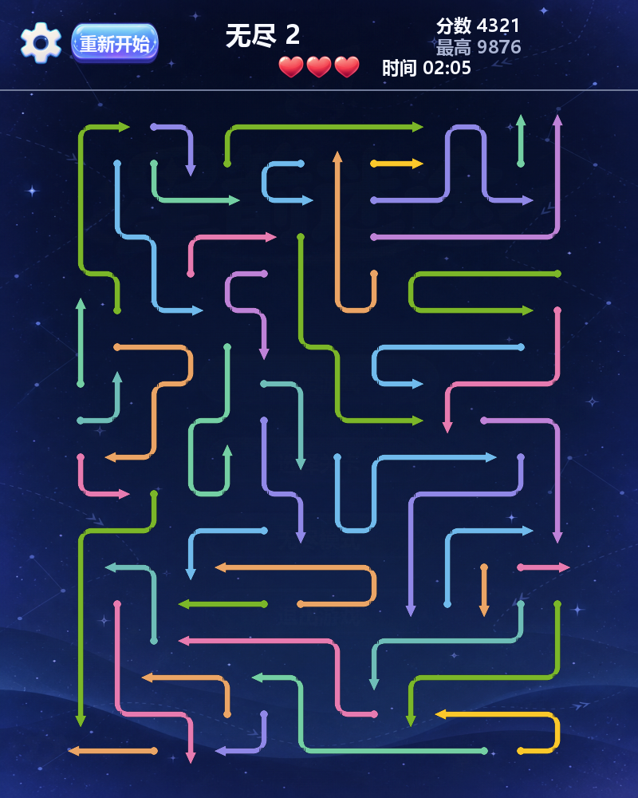
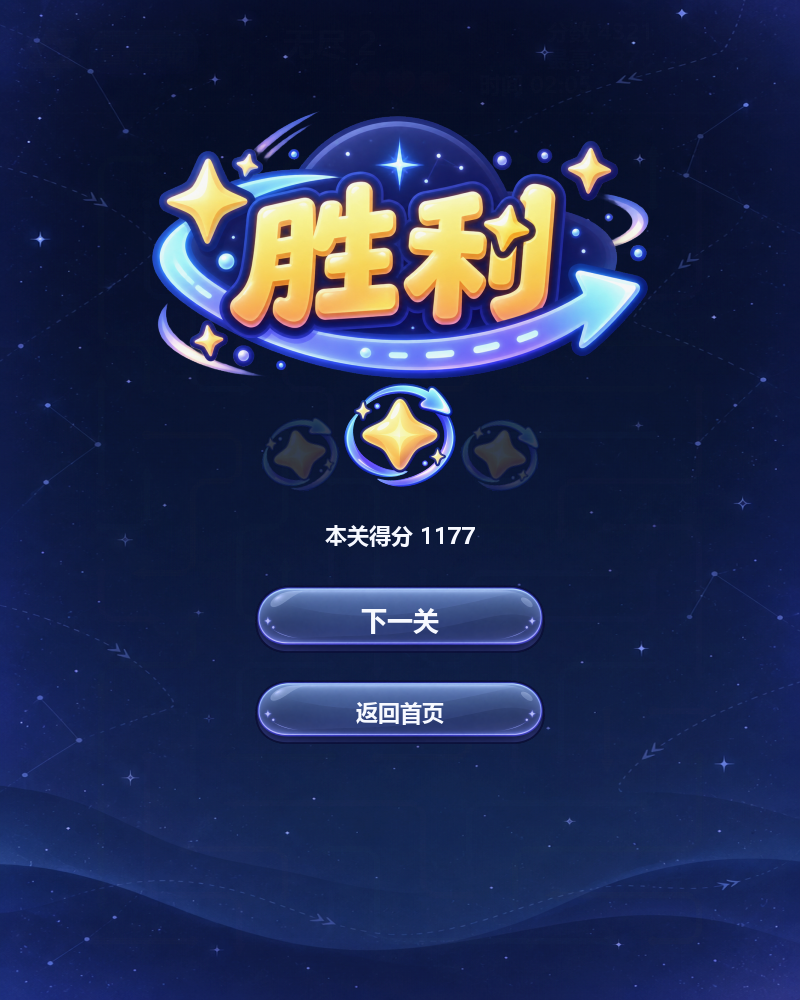

# 星箭迷途

> Python + Pygame 开发的多格折线箭头解谜游戏。当前版本：`v1.0`

## 项目名称

**星箭迷途（Star Arrow）**

## 游戏简介

棋盘中分布着朝向上、下、左、右的箭头。点击箭头后，程序会检查箭头头部到
棋盘边界之间的路径：前方没有其他箭头时，箭头沿自身折线路径飞出；存在阻挡
时，箭头不能消除，第一支阻挡箭头会变红并震动，同时扣除一次失误机会。

玩家需要观察箭头之间的依赖关系，在失误次数和关卡时限耗尽前清空棋盘。

## 主要功能

### 基础玩法

- 开始、选关、游戏、胜利和失败界面；
- 鼠标点击箭头任意线段即可选择整支箭头；
- 支持单格、多格直线和多转角折线箭头；
- 正确处理四个方向的路径阻挡与边界出界；
- 箭头飞出、圆角滑动、棋盘点拖尾和碰撞震动反馈；
- 三次失误机会、倒计时、重新开始和关卡切换；
- 1 个教学关和 5 个固定主题关，全部经过可通关性验证。

### 扩展功能

- **主题关卡**：潮汐回廊、四向机关、同心星环、虹桥织网和星门终阵；
- **限时计分**：基础分、箭头分和剩余时间奖励，完成越快得分越高；
- **星级评价**：通关后根据分数获得一至三星；
- **无尽模式**：在线生成完整覆盖且可通关的随机关卡，分数跨关累计；
- **最高分记录**：持续挑战并刷新无尽模式的历史最高纪录；
- **异形棋盘**：除矩形棋盘外，最终关采用上窄下宽的星门轮廓；
- **渐进挑战**：棋盘规模、箭头数量和依赖关系随关卡逐步增加。

## 开发环境

| 项目 | 要求 |
| --- | --- |
| Python | 3.10 或更高版本 |
| 图形库 | pygame-ce 2.5.2～2.x |
| 操作系统 | Windows、macOS 或 Linux |
| 主要依赖 | 见 `requirements.txt` |

## 安装和运行

### 1. 进入项目目录

```powershell
cd D:\path\to\lab2
```

### 2. 创建并启用虚拟环境（推荐）

Windows PowerShell：

```powershell
python -m venv .venv
.\.venv\Scripts\Activate.ps1
```

macOS / Linux：

```bash
python3 -m venv .venv
source .venv/bin/activate
```

### 3. 安装依赖

```bash
python -m pip install -r requirements.txt
```

### 4. 启动游戏

普通模式：

```bash
python main.py
```

调试模式：

```bash
python main.py --debug
```

### 5. Windows 可执行版

前往 [GitHub Releases](https://github.com/illnessemc/star-arrow/releases) 下载
`StarArrow-v1.0-win64.exe`。该版本无需安装 Python，双击即可启动游戏。

## 游戏操作说明

| 操作 | 说明 |
| --- | --- |
| 鼠标左键 | 点击箭头任意线段，尝试让整支箭头飞出 |
| 齿轮按钮 / `Esc` | 打开设置菜单；计时在菜单中暂停 |
| 重新开始 | 恢复本关初始箭头、失误次数和倒计时 |
| 返回主界面 | 结束当前流程并返回首页 |
| 退出游戏 | 点击首页“退出游戏”或关闭窗口 |

## 关卡与计分

- 固定关时限依次为 60、110、125、155、165 和 180 秒；
- 无尽关从 150 秒开始，随轮次增加并封顶 240 秒；
- 单关得分 = 1000 基础分 + 每支箭头 10 分 + 最多 2000 时间奖励；
- 时间奖励达到 65% 获得三星，达到 30% 获得二星，其余通关获得一星；
- 无尽模式显示当前累计分和历史最高分；
- Windows 最高分文件位于 `%LOCALAPPDATA%\StarArrow\score.json`。

## 自动化测试

在项目根目录运行：

```bash
python -m unittest discover -s test -v
```

测试覆盖正常消除、阻挡扣除、边界出界、通关切换、失败重开、关卡完整覆盖、
可通关性、倒计时、星级、无尽累计分和最高分存储。全部通过时终端最后显示：

```text
Ran 21 tests

OK
```

## 游戏截图

<p align="center">
  
  
  
</p>

## 项目结构

```text
lab2/
├─ main.py                  # 游戏入口与命令行参数
├─ requirements.txt         # Python 依赖
├─ arrow_game/
│  ├─ app.py                # Pygame 页面、输入和动画
│  ├─ core/                 # 箭头、棋盘、规则、求解和计分
│  ├─ data/                 # 固定关、无尽生成器和最高分存储
│  └─ ui/                   # 主题、素材接口和动画队列
├─ resource/image/          # 游戏美术素材
├─ docs/images/             # README 游戏截图
└─ test/                    # 自动化测试
```
